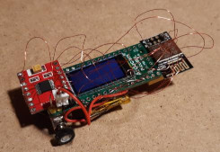
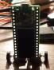
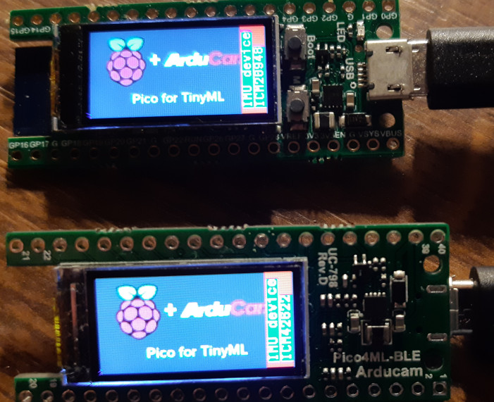
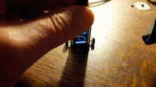

# Pico4ML-BLE / Pico4ML display_imu example

This is Pico4MLcbot for line following based on Pico4ML's camera:  
  

display_imu example will be the basis for creating Pico4MLibot, that will do IMU based 2-wheel balancing:  
 &nbsp;&nbsp;&nbsp;   


Pico4ML-BLE has ICM20948, Pico4ML has ICM42622 IMU:  


ICM20948 is a 9-axis IMU, and "imuDataGet()" allows to query 3 angles in addition to the 3×3 x/y/z values for accel/gyro/magnet. With latest commit simple analog display demo of sensor roll value is added:  
   


See instructions on [Quick Pico Setup](#quick-pico-setup) below in case you have not setup Pico already.

- Download pico-tflmicro

```bash
git clone https://github.com/Hermann-SW/pico-tflmicro.git
```

- Compile ...  
```bash
cd pico-tflmicro/display_imu
mkdir build 
cd build 
cmake ..
```

- ... and  
```bash
time make display_imu
```

- flash, after pressing bootsel button and powering Pico
```bash
cp examples/display_imu/display_imu.uf2 /media/pi/RPI-RP2/
```


# Quick Pico Setup
See [Getting Started with the Raspberry Pi Pico](https://rptl.io/pico-get-started) and the README in the [pico-sdk](https://github.com/raspberrypi/pico-sdk) for information
on getting up and running.

If you are developing for Raspberry Pi Pico on the Raspberry Pi 4B, or the Raspberry Pi 400, most of the installation steps
in this Getting Started guide can be skipped by running the setup script. You can get this script by doing the following:
```bash
git clone https://github.com/raspberrypi/pico-setup.git
```
Then run:
```bash
 pico-setup/pico_setup.sh
```

Once it has run, you will need to reboot your Raspberry Pi,
```bash
sudo reboot
```

